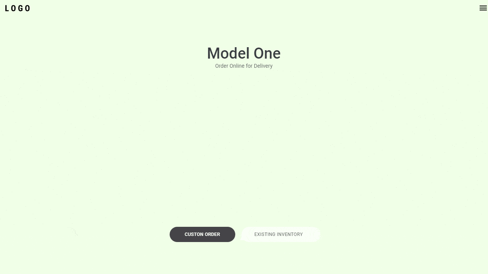

# Clone Tesla

Projeto da aula <a href="https://www.youtube.com/watch?v=Mf4Se4ZGcG8">Homepage da Tesla com ReactJS | UI Clone #14</a> da <a href="https://rocketseat.com.br/">Rocketseat</a>.

Projeto realizado utilizando HTML, CSS e ReactJS.

Me siga no <a href="https://www.linkedin.com/in/jose-de-souza/">Linkedin</a>